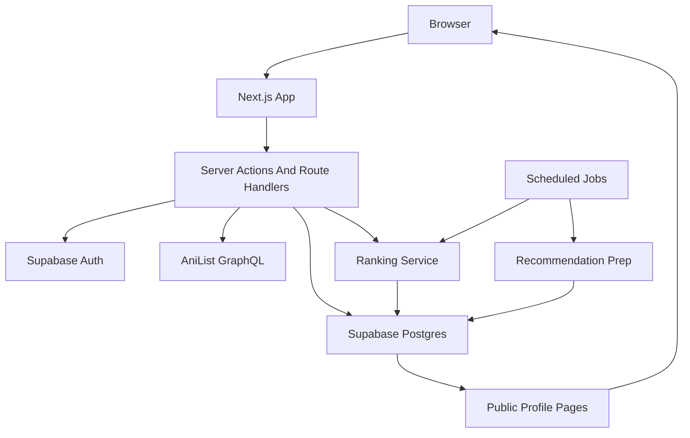
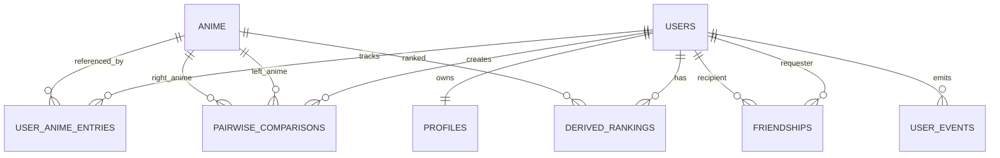
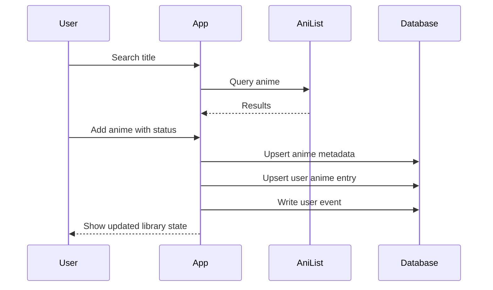
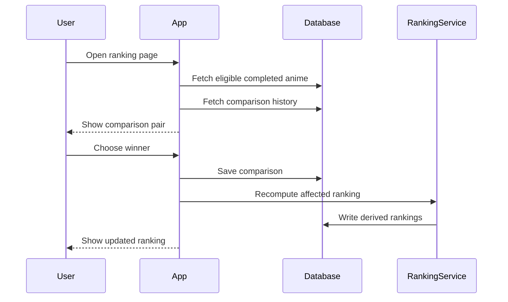
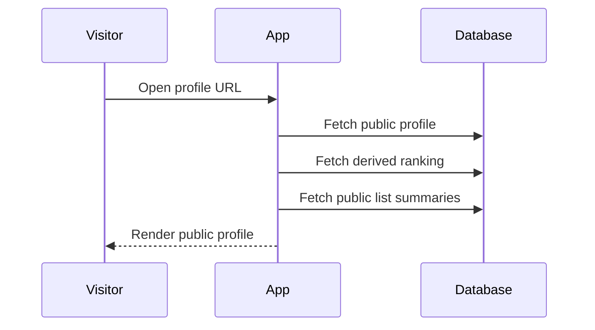

# Anime Tracker Full-Stack App Design

Date: 2026-05-31
Status: Draft

## 1. Executive Summary

This document designs a full-stack web application for tracking anime, building a watchlist, ranking watched anime through Beli-style pairwise comparisons, and discovering friends' lists and rankings through public profiles.

The recommended MVP stack is Next.js App Router, TypeScript, Tailwind CSS, Supabase Postgres/Auth/Storage/Realtime, and AniList GraphQL for anime metadata. This stack optimizes for a fast MVP while preserving a relational data model that can support rankings, friendships, and future recommendations.

The core product bet is that anime tracking should feel lighter than a spreadsheet and more social than a private checklist. Users should be able to add an anime in seconds, keep watching progress up to date, and gradually build a trusted personal ranking through small comparison prompts instead of maintaining a large manual ordered list.

## 2. Goals

### Product Goals

- Make it easy for users to add anime they are watching, completed, paused, dropped, or planning to watch.
- Provide a watchlist flow for bookmarking future watches without forcing a full rating decision.
- Create a distinctive ranking system inspired by Beli, where pairwise comparisons produce ranked lists.
- Let users browse public profiles, lists, and rankings.
- Support friend relationships so users can follow people whose taste they care about.
- Capture enough structured preference data to enable future recommendations.

### Technical Goals

- Keep anime metadata separate from user-specific tracking data.
- Model rankings, comparisons, friendships, and recommendation signals relationally.
- Keep profile and ranking pages fast through cached derived rankings.
- Preserve clear authorization boundaries for public data, friend data, and private account data.

### Non-Goals For MVP

- Native mobile apps.
- Full social feed with comments, likes, and DMs.
- Custom anime metadata administration.
- Import/export from MyAnimeList, AniList, or Kitsu.
- Episode-level community discussion.
- Moderation-heavy public posting features.

## 3. Target Users

### Primary User: Personal Tracker

This user wants a clean way to track what they have watched and what they plan to watch. They care about speed, search quality, and not losing track of shows between seasons.

### Secondary User: Taste Sharer

This user wants to compare favorites with friends. They care about public profiles, ranked lists, and seeing how friends' taste differs from theirs.

### Future User: Recommendation Seeker

This user wants the app to suggest anime they are likely to enjoy. They care less about manually browsing and more about the app learning from rankings and watch behavior.

## 4. Recommended Stack

### Recommended MVP Stack

- Frontend and backend: Next.js App Router with TypeScript
- Styling: Tailwind CSS plus a small component system
- Database: Supabase Postgres
- Auth: Supabase Auth
- ORM/query layer: Drizzle ORM or Supabase typed clients
- Metadata source: AniList GraphQL API
- Hosting: Vercel for Next.js, Supabase for database/auth/storage
- Background jobs: Vercel Cron, Supabase Edge Functions, or a lightweight queue later
- Analytics: PostHog or Vercel Analytics
- Error tracking: Sentry

### Why This Stack

Supabase keeps the app close to a normal Postgres architecture while providing hosted auth and useful managed services. That matters because this product has relational data at its core: users have anime entries, entries produce comparisons, comparisons produce rankings, rankings are visible on profiles, and friends connect users into a social graph.

Next.js App Router is a strong fit because many product surfaces are server-renderable: public profiles, anime detail pages, ranked lists, and watchlists. Server actions or route handlers can handle mutations while keeping the frontend relatively simple.

AniList avoids building a custom anime catalog. The app should cache normalized anime records locally when users interact with them, while treating AniList as the source for search and enrichment.

## 5. MVP Scope

### In Scope

- Email/password and OAuth authentication.
- User profiles with username, display name, avatar, bio, and public profile URL.
- Anime search powered by AniList.
- Anime detail pages with metadata, cover image, genres, season/year, format, status, and description.
- User library entries with status, progress, notes, started date, completed date, and optional personal rating.
- Watchlist via `plan_to_watch` status.
- Pairwise comparison prompts for completed anime.
- Generated personal rankings from comparison history.
- Public profile pages showing watched anime, watchlist, and ranked favorites.
- Friend requests and accepted friend relationships.
- Browse friends' profiles and rankings.
- Basic privacy controls for account-level sensitive data.

### Out Of Scope Until Later

- Native apps.
- Offline support.
- Advanced recommendation engine.
- Direct messaging.
- Comments and public discussion threads.
- Moderator console.
- Imports from third-party anime trackers.
- Paid subscriptions.

## 6. Core Product Principles

### Fast Capture

Adding or updating an anime should take less than 10 seconds from search. The user should not need to answer ranking questions while adding something unless they choose to.

### Rankings Improve Gradually

The app should not demand that users rank everything at once. It should ask small, contextual comparison questions and improve rankings over time.

### Public By Default, Account-Private By Design

Profiles, lists, and rankings are public by default. Email addresses, auth providers, internal IDs, notification settings, and private account metadata are never public.

### Recommendations Need Clean Signals

Every ranking comparison, watch status update, completion, rewatch, and dropped anime is a future recommendation signal. The data model should preserve these events rather than only storing final state.

## 7. User Journeys

### 7.1 Onboarding

1. User signs up with email or OAuth.
2. User chooses a unique username.
3. User optionally adds display name, avatar, and bio.
4. User is prompted to search for anime they have already completed.
5. User can skip onboarding and start with search or watchlist.

Success criteria:

- User reaches the main app within one minute.
- Username uniqueness errors are clear.
- Empty states explain the first useful action.

### 7.2 Add Watched Anime

1. User searches for an anime by title.
2. App displays AniList results with title, cover, year, format, and episode count.
3. User opens an anime detail page or quick-add menu.
4. User selects status: watching, completed, paused, dropped, or plan to watch.
5. If completed, the anime becomes eligible for pairwise ranking.
6. App confirms the add and suggests the next useful action.

Useful next actions:

- "Compare this with another completed anime"
- "Add another anime"
- "View your ranking"
- "Update progress"

### 7.3 Manage Watchlist

1. User adds anime as `plan_to_watch`.
2. Watchlist page groups entries by priority, genre, or date added.
3. User can move an anime to `watching` when they start it.
4. User can remove entries or mark them as not interested.

MVP watchlist sorting:

- Recently added
- Title
- Release year
- Optional manual priority: low, medium, high

### 7.4 Pairwise Ranking

1. User opens the ranking page.
2. App presents two completed anime.
3. User answers "Which do you prefer?"
4. App stores the comparison.
5. Ranking updates after each comparison or after a short recalculation.
6. App shows ranking confidence and invites more comparisons where uncertainty is high.

Comparison actions:

- Pick left anime.
- Pick right anime.
- Skip because the user cannot decide.
- Mark as not comparable if one entry is unfamiliar or mistakenly completed.

### 7.5 View Public Profile

1. Visitor opens `/u/:username`.
2. Page shows profile info, top-ranked anime, recent activity, watched count, and watchlist highlights.
3. Visitor can browse full rankings, completed anime, watching list, and watchlist.
4. Authenticated visitors can send a friend request.

Public profile defaults:

- Visible: display name, username, avatar, bio, public lists, rankings, aggregate stats.
- Hidden: email, auth identities, private settings, notification preferences.

### 7.6 Friends

1. User searches for another user by username.
2. User sends a friend request.
3. Recipient accepts or declines.
4. Accepted friends appear in the friends list.
5. Users can browse friends' rankings from a friend dashboard.

MVP friend value:

- Easier access to known profiles.
- Compare rankings with friends.
- Later: friend-based recommendation signals.

## 8. Information Architecture

### Primary Navigation

- Home: current watching, ranking prompts, friend highlights.
- Search: anime search and discovery.
- Library: all user anime entries by status.
- Ranking: pairwise comparison and ranked list.
- Friends: friend list, requests, and discovery.
- Profile: public profile preview and settings.

### Main Screens

#### Home

Purpose: Resume the most useful action.

Sections:

- Continue watching.
- Quick add/search.
- Ranking prompt.
- Recent friend rankings.
- Watchlist reminders.

#### Search

Purpose: Find anime quickly.

Sections:

- Search input.
- Result cards.
- Filters for format, year, season, status, genre.
- Quick-add status actions.

#### Anime Detail

Purpose: Show metadata and the user's relationship to the anime.

Sections:

- Hero with title, cover, description, and metadata.
- User status card.
- Progress controls.
- Ranking eligibility.
- Friends who watched it.

#### Library

Purpose: Manage tracked anime.

Sections:

- Tabs by status.
- Filters and sort.
- Entry cards with progress, notes, and dates.
- Bulk-free MVP; keep interactions per entry.

#### Ranking

Purpose: Build and view personal rankings.

Sections:

- Pairwise comparison card.
- Current ranked list.
- Confidence indicators.
- Filters by format or genre in later versions.

#### Friends

Purpose: Browse social graph.

Sections:

- Friend search.
- Incoming requests.
- Outgoing requests.
- Friend list.
- Friend ranking highlights.

#### Public Profile

Purpose: Let others understand a user's taste.

Sections:

- Profile header.
- Top 10 ranked anime.
- Recently completed.
- Watching now.
- Watchlist highlights.
- Full public lists.

## 9. System Architecture

### Frontend Responsibilities

- Render app routes and public profile pages.
- Provide fast search, status updates, and comparison interactions.
- Manage optimistic UI for low-risk actions such as status updates.
- Display ranking confidence and empty states.
- Keep forms accessible and mobile-friendly.

### Backend Responsibilities

- Authenticate users.
- Enforce authorization.
- Normalize and cache anime metadata.
- Persist user library entries.
- Persist pairwise comparisons.
- Compute and cache rankings.
- Manage friend requests and relationships.
- Emit analytics and event records for recommendation readiness.

### External Services

- AniList GraphQL for anime metadata search and enrichment.
- Supabase for database, auth, storage, and optional realtime.
- Vercel for app hosting and cron triggers.
- Sentry for error tracking.
- PostHog or Vercel Analytics for product analytics.

## 10. Data Model

### Entity Overview

### `users`

Managed primarily by Supabase Auth.

Fields:

- `id`
- `email`
- `created_at`
- `last_sign_in_at`

Public exposure: never expose email or auth metadata.

### `profiles`

Public user-facing profile data.

Fields:

- `user_id`
- `username`
- `display_name`
- `avatar_url`
- `bio`
- `profile_visibility`
- `created_at`
- `updated_at`

MVP visibility: public profiles by default. `profile_visibility` exists for future private or friends-only modes.

### `anime`

Local cache of anime metadata from AniList.

Fields:

- `id`
- `anilist_id`
- `romaji_title`
- `english_title`
- `native_title`
- `description`
- `cover_image_url`
- `banner_image_url`
- `format`
- `episodes`
- `duration_minutes`
- `season`
- `season_year`
- `status`
- `genres`
- `average_score`
- `popularity`
- `source`
- `metadata_updated_at`

Rule: create or refresh records when users search, open details, or add entries.

### `user_anime_entries`

User-specific tracking state.

Fields:

- `id`
- `user_id`
- `anime_id`
- `status`
- `progress_episodes`
- `rewatch_count`
- `priority`
- `notes`
- `personal_score`
- `started_at`
- `completed_at`
- `created_at`
- `updated_at`

Constraints:

- Unique `user_id`, `anime_id`.
- `status` enum: `watching`, `completed`, `paused`, `dropped`, `plan_to_watch`.
- `progress_episodes` cannot be negative.
- Completed entries are eligible for ranking.

### `pairwise_comparisons`

Ranking input events.

Fields:

- `id`
- `user_id`
- `left_anime_id`
- `right_anime_id`
- `winner_anime_id`
- `comparison_context`
- `skipped_reason`
- `created_at`

Rules:

- Both anime must belong to completed entries for that user.
- `winner_anime_id` must be either left or right unless skipped.
- Store skipped comparisons for prompt selection quality, but exclude them from ranking score calculations.
- Do not overwrite old comparisons. Preferences can shift over time, and history is useful for recommendations.

### `derived_rankings`

Cached output of ranking computation.

Fields:

- `id`
- `user_id`
- `anime_id`
- `rank`
- `score`
- `confidence`
- `comparison_count`
- `algorithm_version`
- `computed_at`

Rules:

- Unique `user_id`, `anime_id`, `algorithm_version`.
- Recompute after new comparisons, completed-entry changes, or algorithm changes.
- Public profile pages read from this table for speed.

### `friendships`

Friend request and accepted friend relationship.

Fields:

- `id`
- `requester_id`
- `recipient_id`
- `status`
- `created_at`
- `responded_at`

Status enum:

- `pending`
- `accepted`
- `declined`
- `blocked`

Constraints:

- Prevent duplicate active relationships between the same two users.
- Prevent users from friending themselves.

### `user_events`

Append-only product and recommendation signal log.

Fields:

- `id`
- `user_id`
- `event_type`
- `anime_id`
- `metadata`
- `created_at`

Event examples:

- `anime_added`
- `status_changed`
- `progress_updated`
- `anime_completed`
- `comparison_created`
- `ranking_viewed`
- `friend_request_sent`
- `friend_profile_viewed`

Purpose: keep recommendation signals even if current state changes.

## 11. Ranking System

### Product Model

The primary ranking input is pairwise comparison: "Which anime do you prefer?" This avoids forcing users to assign precise scores and makes ranking feel like a lightweight game.

### MVP Algorithm

Use an Elo-style scoring model per user.

Initial score:

- Every completed anime starts at `1500`.

On comparison:

- Winner gains points.
- Loser loses points.
- Point delta depends on expected outcome.
- Confidence increases with comparison count.

Why Elo for MVP:

- Simple to explain.
- Easy to implement.
- Works incrementally.
- Does not require users to compare every pair.
- Produces stable enough rankings for personal lists.

Limitations:

- Ordering can depend on comparison sequence.
- Sparse comparisons create low-confidence rankings.
- It does not directly model uncertainty as well as Bayesian systems.

### Future Algorithm Improvements

Consider moving to TrueSkill, Glicko, or a Bradley-Terry model once data volume grows.

Future ranking features:

- Genre-specific rankings.
- Seasonal rankings.
- Movies vs series filtering.
- Friend comparison view.
- "You and this friend both loved..." view.
- Ranking confidence prompts that choose high-information comparisons.

### Prompt Selection

The comparison prompt should avoid random-only selection. It should prefer pairs that improve ranking quality.

MVP prompt strategy:

1. Only include completed anime.
2. Prefer anime with low comparison counts.
3. Prefer anime with similar current scores.
4. Avoid showing the same pair repeatedly.
5. Allow skips without penalty.

Future prompt strategy:

- Select pairs with the highest uncertainty reduction.
- Consider recency and popularity.
- Let users focus comparisons by genre or format.

### Ranking Confidence

Confidence should be displayed softly, not as a technical metric.

Examples:

- "Needs more comparisons"
- "Getting clearer"
- "Well established"

Suggested confidence formula for MVP:

- Low: fewer than 3 comparisons involving the anime.
- Medium: 3 to 7 comparisons.
- High: 8 or more comparisons.

This can later account for score volatility and graph connectivity.

## 12. Recommendation Readiness

Recommendations are a future feature, but the MVP should collect clean preference signals now.

### Signals To Capture

- Completed anime.
- Dropped anime.
- Plan-to-watch anime.
- Pairwise comparison winners and losers.
- Ranking scores and confidence.
- Genres, studios, formats, season years, and source material.
- Friend overlap and friend differences.
- Rewatches.
- Manual scores, if present.

### Phase 1 Recommendations

No machine learning needed.

Approach:

- Recommend anime from genres and formats the user ranks highly.
- Boost anime that friends rank highly.
- Exclude anime already tracked.
- Down-rank genres or formats often dropped by the user.

### Phase 2 Recommendations

Collaborative filtering.

Approach:

- Find users with similar ranking patterns.
- Recommend anime they completed and ranked highly.
- Use pairwise preference data as stronger signal than raw watch status.

### Phase 3 Recommendations

Hybrid model.

Approach:

- Combine collaborative filtering, content features, and friend graph signals.
- Use pairwise outcomes to learn taste vectors.
- Explain recommendations with simple reasons.

Example explanations:

- "Because you ranked character-driven dramas highly."
- "Popular among friends who also loved your top 10."
- "Similar tone and genres to three shows you ranked above average."

## 13. API And Server Action Design

### Auth

- `signUp`
- `signIn`
- `signOut`
- `getCurrentUser`
- `completeProfile`

### Anime Metadata

- `searchAnime(query, filters)`
- `getAnimeDetails(anilistId)`
- `syncAnimeMetadata(anilistId)`

### Library

- `addAnimeEntry(animeId, status)`
- `updateAnimeEntry(entryId, patch)`
- `removeAnimeEntry(entryId)`
- `listUserAnimeEntries(userId, filters)`
- `updateProgress(entryId, progress)`

### Ranking

- `getNextComparisonPair()`
- `submitComparison(leftAnimeId, rightAnimeId, winnerAnimeId)`
- `skipComparison(leftAnimeId, rightAnimeId, reason)`
- `getUserRanking(userId)`
- `recomputeUserRanking(userId)`

### Friends

- `searchUsers(query)`
- `sendFriendRequest(recipientId)`
- `respondToFriendRequest(friendshipId, response)`
- `listFriends(userId)`
- `listFriendRequests()`

### Profiles

- `getPublicProfile(username)`
- `getPublicRanking(username)`
- `getPublicLists(username)`
- `updateProfile(patch)`

## 14. Authorization Model

### Public Reads

Allowed:

- Public profile data.
- Public rankings.
- Public anime lists.
- Public aggregate stats.

Denied:

- Email addresses.
- Auth identities.
- Private settings.
- Internal event logs.
- Non-public future fields.

### Authenticated Writes

Users can write:

- Their own profile.
- Their own library entries.
- Their own pairwise comparisons.
- Friend requests involving themselves.

Users cannot write:

- Other users' entries.
- Other users' rankings.
- Derived ranking rows directly.
- Anime metadata except through controlled sync paths.

### Friend-Specific Reads

MVP public profiles do not need friend-only list access. Friendship is mainly a discovery and relationship feature. The schema should still support future visibility levels.

## 15. Data Flow

### Add Anime Flow

### Pairwise Ranking Flow

### Public Profile Flow

## 16. UX Details

### Adding And Tracking

The app should prioritize quick actions:

- Search result cards should include "Watchlist", "Watching", and "Completed" actions.
- Anime detail pages should show the current user's status prominently.
- Progress updates should be one tap or one small input away.
- Completing an anime should offer, but not force, a ranking comparison.

### Watchlist

The watchlist should feel separate from completed rankings. Users often bookmark with less certainty than they rate. Watchlist entries should support lightweight priority without requiring notes or scores.

Recommended MVP fields:

- Status: `plan_to_watch`
- Priority: low, medium, high
- Date added

### Pairwise Ranking UI

The comparison UI should be simple and mobile-first:

- Two large anime cards.
- Cover image, title, year, format, and user's optional note.
- Primary question: "Which did you enjoy more?"
- Buttons: left, right, skip.
- Link to open details if the user needs context.

Avoid showing too much numeric scoring in the MVP. The experience should feel like expressing taste, not tuning an algorithm.

### Public Profiles

Profiles should make taste immediately legible:

- Top-ranked anime above the fold.
- Watching now and recently completed as secondary sections.
- Watchlist visible but less prominent.
- Friend action near the profile header.

### Empty States

Examples:

- No library entries: "Search for an anime to start building your list."
- No completed anime: "Complete an anime to unlock rankings."
- Not enough comparisons: "Compare a few favorites to build your ranking."
- No friends: "Find friends by username and compare rankings."

## 17. Error Handling

### Search Failures

If AniList is unavailable:

- Show a friendly error.
- Let the user retry.
- Keep local recently viewed anime available if cached.

### Duplicate Adds

If a user adds an anime already in their library:

- Update status instead of creating duplicates.
- Show a message: "Already in your library. Status updated."

### Ranking Edge Cases

If fewer than two completed anime exist:

- Hide pairwise prompt.
- Explain how to unlock ranking.

If a compared anime is no longer completed:

- Exclude it from future prompts.
- Keep historical comparison records.
- Recompute ranking without ineligible anime.

### Friend Request Edge Cases

- Prevent duplicate pending requests.
- If two users request each other, convert to accepted friendship.
- Block self-friend requests.
- Respect blocked relationships in future versions.

## 18. Accessibility And Mobile UX

### Accessibility

- All interactive controls must be keyboard accessible.
- Comparison cards must have clear button labels.
- Cover images need meaningful alt text.
- Color cannot be the only indicator of status or ranking confidence.
- Forms need inline validation messages.
- Public profile and ranking pages need semantic headings.

### Mobile UX

- Ranking comparisons should fit comfortably on a phone.
- Bottom navigation is appropriate for primary app sections.
- Search and quick-add interactions should avoid dense tables.
- Tap targets should be large enough for repeated ranking actions.

## 19. Security And Privacy

### Security Controls

- Use row-level security policies for all user-owned tables.
- Validate all server-side mutations.
- Rate limit search, friend requests, and comparison submissions.
- Use unique usernames with normalized casing.
- Sanitize profile bio and notes.
- Store external image URLs, not downloaded images, unless storage is needed later.

### Privacy Controls

MVP:

- Public profiles and lists by default.
- Private account data never exposed.
- Users can delete their own entries and comparisons.

Future:

- Profile visibility: public, friends-only, private.
- Per-list visibility.
- Blocked users.
- Data export.
- Account deletion workflow.

## 20. Testing Strategy

### Unit Tests

- Ranking score updates.
- Prompt selection.
- Visibility and authorization helpers.
- Status transition validation.
- Username normalization.

### Integration Tests

- Add anime from search result.
- Update library entry status.
- Submit comparison and verify ranking changes.
- Send, accept, and decline friend requests.
- Render public profile with rankings.

### End-To-End Tests

- Onboard a new user and add first anime.
- Build a ranking from multiple comparisons.
- View another user's public profile.
- Send and accept a friend request.

### Data Tests

- Ensure one library entry per user/anime.
- Ensure comparison winner is valid.
- Ensure derived rankings are unique per user/anime/algorithm version.
- Ensure public profile queries do not include private fields.

## 21. Analytics And Observability

### Product Analytics

Track:

- Signup completion.
- Anime searches.
- Anime adds by status.
- Completion events.
- Pairwise comparisons submitted.
- Skips.
- Ranking page visits.
- Public profile views.
- Friend requests sent and accepted.

Key metrics:

- Activation: user adds at least 3 anime.
- Ranking activation: user completes at least 5 comparisons.
- Social activation: user views or adds at least 1 friend.
- Retention: user updates progress or submits comparison after first week.

### Engineering Observability

Monitor:

- AniList API failures and latency.
- Database query performance for public profiles.
- Ranking recomputation time.
- Auth errors.
- Server action validation failures.

## 22. Rollout Plan

### Milestone 1: Foundation

- Set up Next.js app.
- Configure auth.
- Create database schema.
- Build profile creation.
- Integrate AniList search.

### Milestone 2: Tracking

- Add anime metadata caching.
- Build add/update library flows.
- Build library and watchlist pages.
- Add progress tracking.

### Milestone 3: Ranking

- Build completed-anime eligibility.
- Build pairwise comparison UI.
- Implement Elo-style ranking.
- Cache derived rankings.
- Build ranking page.

### Milestone 4: Social

- Build public profile pages.
- Build user search.
- Build friend requests.
- Build friends dashboard.

### Milestone 5: Recommendation Readiness

- Add event logging.
- Add basic analytics.
- Add recommendation signal views for internal debugging.
- Prepare first rules-based recommendation prototype.

## 23. Open Product Decisions

These decisions can wait until implementation planning:

- Whether `personal_score` should exist in MVP or be deferred entirely.
- Whether watchlist priority should be manual, automatic, or omitted.
- Whether ranking should include only completed anime or allow dropped anime in a separate "least favorite" list.
- Whether public profile pages should be indexable by search engines.
- Whether usernames can be changed after creation.

Recommended defaults:

- Include optional `personal_score`, but do not make it prominent.
- Include simple watchlist priority.
- Rank only completed anime in MVP.
- Do not index public profiles until privacy settings mature.
- Allow username changes with rate limits and reserved-name checks.

## 24. Risks And Mitigations

### Risk: Pairwise Ranking Feels Tedious

Mitigation:

- Ask for comparisons opportunistically.
- Keep each comparison interaction fast.
- Show visible progress and ranking changes.
- Allow users to stop anytime.

### Risk: Rankings Feel Wrong With Sparse Data

Mitigation:

- Display confidence labels.
- Prefer high-information comparison prompts.
- Avoid overclaiming precision.
- Let users keep comparing to improve results.

### Risk: Public Profiles Create Privacy Surprises

Mitigation:

- Clearly explain public profile visibility during onboarding.
- Never expose private account data.
- Keep future visibility fields in the schema.
- Add privacy controls before adding richer social content.

### Risk: External Metadata API Becomes A Bottleneck

Mitigation:

- Cache anime records locally.
- Rate limit search.
- Degrade gracefully if AniList fails.
- Store enough normalized data for tracked anime to render without live API calls.

### Risk: Recommendation Feature Is Hard To Add Later

Mitigation:

- Store append-only user events.
- Preserve pairwise comparison history.
- Cache derived ranking scores with algorithm versions.
- Keep anime metadata structured by genres, format, source, and season.

## 25. Recommended MVP Data Access Pattern

Use server actions for authenticated mutations where possible:

- Add entry.
- Update status.
- Submit comparison.
- Send friend request.

Use server-rendered routes for public reads:

- Public profile.
- Public ranking.
- Anime details.

Use client components for interactive surfaces:

- Search input and filters.
- Pairwise comparison cards.
- Progress controls.
- Friend request buttons.

This balances performance, simplicity, and interactivity.

## 26. Summary Recommendation

Build the MVP with Next.js, TypeScript, Supabase, Tailwind CSS, and AniList. Keep the first version focused on fast tracking, watchlists, pairwise rankings, public profiles, and friends. Use an Elo-style ranking model for the first implementation because it is understandable, incremental, and easy to evolve.

The design should preserve future recommendation flexibility by storing structured anime metadata, append-only user events, comparison history, and versioned derived rankings. This lets the product start simple while collecting the preference data needed for stronger recommendations later.
